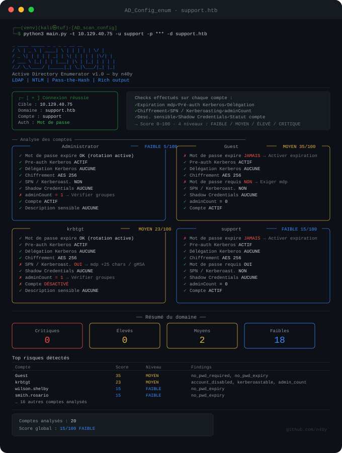

# AD_Config_enum

Outil d'audit de configurations Active Directory. Se connecte à un contrôleur de domaine via LDAP, énumère les comptes utilisateurs et détecte les mauvaises configurations de sécurité courantes (Kerberoasting, AS-REP Roasting, délégation non contrainte, Shadow Credentials, etc.), avec un score de risque et un export JSON.




## Sommaire

- [Disclaimer](#disclaimer)
- [Fonctionnalités](#fonctionnalités)
- [Checks effectués](#checks-effectués)
- [Installation](#installation)
- [Utilisation](#utilisation)
- [Modes d'authentification](#modes-dauthentification)
- [Architecture du projet](#architecture-du-projet)
- [Limitations connues](#limitations-connues)
- [Licence](#licence)

## Disclaimer

> [!CAUTION]
> **Cet outil est destiné exclusivement à un usage légal et autorisé** : audits de sécurité dans le cadre d'un mandat (pentest, red team), environnements de lab personnels, ou plateformes d'entraînement type HackTheBox / TryHackMe.
>
> L'énumération non autorisée d'un Active Directory que vous ne possédez pas ou pour lequel vous n'avez pas d'autorisation écrite explicite est **illégale** dans la plupart des juridictions (en France, notamment au titre des articles 323-1 et suivants du Code pénal).
>
> L'auteur ne pourra être tenu responsable d'une utilisation malveillante, non autorisée ou contraire à la loi de cet outil. **Vous êtes seul responsable de l'usage que vous en faites.**

## Fonctionnalités

- Connexion LDAP vers un contrôleur de domaine via trois modes d'authentification (null session, mot de passe, pass-the-hash)
- Énumération des comptes utilisateurs du domaine et de leurs attributs de sécurité
- Détection automatisée de 10 mauvaises configurations courantes
- Score de risque par compte (0 à 100) avec 4 niveaux de criticité
- Affichage terminal enrichi via [Rich](https://github.com/Textualize/rich) (panels, tableaux, couleurs)
- Résumé global du domaine avec top des comptes à risque
- Export JSON structuré des résultats
- Mode démo sans connexion réelle pour tester l'outil

## Checks effectués

| Check | Détection | Sévérité |
|---|---|---|
| `pwd_in_description` | Mot de passe en clair dans le champ description | Critique |
| `asrep_roastable` | Pré-authentification Kerberos désactivée (AS-REP Roasting) | Critique |
| `unconstrained_deleg` | Délégation Kerberos non contrainte | Critique |
| `no_pwd_required` | Compte sans mot de passe requis | Critique |
| `kerberoastable` | SPN exposé (Kerberoasting) | Élevé |
| `shadow_credentials` | Attribut `msDS-KeyCredentialLink` présent | Élevé |
| `no_pwd_expiry` | Mot de passe sans expiration | Élevé |
| `des_only` | Chiffrement Kerberos limité à DES | Moyen |
| `admin_count` | `adminCount = 1` (compte ou ancien compte à privilèges) | Info |
| `account_disabled` | Compte désactivé | Info |

Le score global de chaque compte est une somme pondérée des findings détectés (plafonnée à 100), répartie en 4 niveaux : **FAIBLE**, **MOYEN**, **ÉLEVÉ**, **CRITIQUE**.

## Installation

### Créer un environnement virtuel

**Linux / macOS**
```bash
python3 -m venv venv
source venv/bin/activate
```

**Windows**
```bash
python3 -m venv venv
.\venv\Scripts\activate
```

### Installer les dépendances

```bash
pip install -r requirements.txt
```

## Utilisation

```bash
python main.py -t <cible> -d <domaine> [options]
```

### Options

| Flag | Description |
|---|---|
| `-t`, `--target` | IP ou hostname du contrôleur de domaine (**requis**) |
| `-d`, `--domain` | Nom du domaine, ex. `corp.local` (**requis**) |
| `-u`, `--user` | Nom d'utilisateur |
| `-p`, `--password` | Mot de passe en clair |
| `-H`, `--hashNTLM` | Hash NT seul, pour une authentification Pass-the-Hash |
| `-o`, `--output` | Fichier de sortie JSON |
| `-v`, `--verbose` | Affiche tous les comptes, y compris ceux sans finding |

### Exemple

```bash
python main.py -t 10.129.40.75 -u support -p 'MotDePasse123' -d support.htb -o rapport.json
```

### Mode démo

Pour tester l'outil sans connexion réelle à un AD :

```bash
python demo.py
```

## Modes d'authentification

| Mode | Commande | Description |
|---|---|---|
| Null session | `-t <ip> -d <domaine>` | Connexion anonyme, sans credentials. Bloquée sur la majorité des AD modernes mais reste utile en reconnaissance initiale. |
| Mot de passe | `-u <user> -p <pass> -d <domaine>` | Authentification NTLM classique. |
| Mot de passe (interactif) | `-u <user> -d <domaine>` | Le mot de passe est demandé via prompt sécurisé (3 tentatives max). |
| Pass-the-Hash | `-u <user> -H <NTHASH> -d <domaine>` | Authentification via hash NT, sans connaître le mot de passe en clair. |

## Architecture du projet

```
AD_Config_enum/
├── main.py                  # Point d'entrée, parsing CLI, orchestration
├── demo.py                  # Mode démo (données simulées, sans connexion réseau)
├── core/
│   ├── connection.py        # Connexion LDAP (null session / NTLM / pass-the-hash)
│   └── analyzer.py          # Logique de détection des mauvaises configurations
├── export/
│   └── json_export.py       # Export des résultats au format JSON
├── output/
│   ├── banner.py             # Bannière et infos de connexion
│   ├── renderer.py          # Affichage détaillé par compte
│   └── summary.py           # Résumé global du domaine
└── requirements.txt
```

## Limitations connues

- La connexion LDAP s'effectue en clair sur le port 389 (pas de LDAPS/StartTLS). L'authentification NTLM ne transmet pas le mot de passe en clair sur le réseau, mais le trafic LDAP applicatif lui-même n'est pas chiffré — à éviter sur un réseau non maîtrisé.
- La null session est bloquée par défaut sur la plupart des Active Directory récents (durcissement post-2016) ; elle reste pertinente en phase de reconnaissance ou sur des environnements legacy / CTF.
- L'outil énumère uniquement les comptes utilisateurs (`objectClass=user`, hors `computer`) ; les comptes machines et groupes ne sont pas couverts dans cette version.
- Les détections reposent sur les attributs LDAP exposés par le DC ; certaines configurations (ex. ACL fines, relations de confiance) ne sont pas analysées.

## Licence

Distribué sous licence MIT. Voir le fichier [LICENSE](LICENSE) pour le texte complet.
